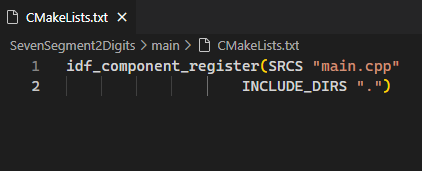
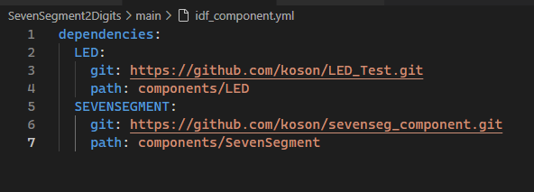
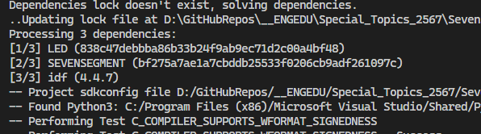

# ใบงานที่ 8-1 Seven Segment 2 Digits
ในใบงานนี้ เราจะใช้ Component ที่สร้างไว้จากในงานก่อนหน้า นั่นคือ LED และ SevenSegment มา reuse ในโปรเจคนี้

## 1.สร้าง ESP-IDF project ชื่อ  SevenSegment2Digits

1.1.1  เปลียนชื่อไฟล์ main.c เป็น main.cpp และแก้ไขฟังก์ชัน main โดยการเพิ่ม `extern "C"` ไว้หน้าชื่อ `app_main()` ดังนี้ 


1.1.2  ตรวจสอบให้แน่ในว่าในไฟล์ CMakeLists.txt ได้เปลี่ยนขื่อ main.c เป็น main.cpp แล้ว



1.1.3 เพิ่มไฟล์ idf_component.yml ในโฟลเดอร์ main และแก้ไขเนื้อหาในไฟล์นั้น


เปลี่ยนชื่อ git repo และ path เป็นที่อยู่ตามที่นักศึกษา push ขึ้นไปไว้บน github

1.1.4 Build โปรแกรม ควรจะสามารถ build ได้ถูกต้อง
ตัว build ควรจะรายงาน dependencies  จำนวน 3 ตัว (idf version อาจจะแตกต่างกันไปตามที่นึกศึกษาได้ติดตั้งไว้บนเครื่อง)



1.1.5 แก้ไขไฟล์ main.cpp เป็นดังนี้

```cpp
#include <stdio.h>

#include "SevenSegment.h"

SevenSegment s1(0) ;
SevenSegment s2(4) ;

extern "C" void app_main(void)
{
while(1)
    {
        s1.DisplayNum0();
        vTaskDelay(500/portTICK_PERIOD_MS);
        s1.DisplayNum1();
        vTaskDelay(500/portTICK_PERIOD_MS);
        s1.DisplayNum2();
        vTaskDelay(500/portTICK_PERIOD_MS);
        s1.DisplayNum3();
        vTaskDelay(500/portTICK_PERIOD_MS);
        s1.DisplayNum4();
        vTaskDelay(500/portTICK_PERIOD_MS);
        s1.DisplayNum5();
        vTaskDelay(500/portTICK_PERIOD_MS);
        s1.DisplayNum6();
        vTaskDelay(500/portTICK_PERIOD_MS);
        s1.DisplayNum7();
        vTaskDelay(500/portTICK_PERIOD_MS);
        s1.DisplayNum8();
        vTaskDelay(500/portTICK_PERIOD_MS);
        s1.DisplayNum9();
        vTaskDelay(500/portTICK_PERIOD_MS);
        s1.DisplayBlank();

        s2.DisplayNum0();
        vTaskDelay(500/portTICK_PERIOD_MS);
        s2.DisplayNum1();
        vTaskDelay(500/portTICK_PERIOD_MS);
        s2.DisplayNum2();
        vTaskDelay(500/portTICK_PERIOD_MS);
        s2.DisplayNum3();
        vTaskDelay(500/portTICK_PERIOD_MS);
        s2.DisplayNum4();
        vTaskDelay(500/portTICK_PERIOD_MS);
        s2.DisplayNum5();
        vTaskDelay(500/portTICK_PERIOD_MS);
        s2.DisplayNum6();
        vTaskDelay(500/portTICK_PERIOD_MS);
        s2.DisplayNum7();
        vTaskDelay(500/portTICK_PERIOD_MS);
        s2.DisplayNum8();
        vTaskDelay(500/portTICK_PERIOD_MS);
        s2.DisplayNum9();
        vTaskDelay(500/portTICK_PERIOD_MS);
        s2.DisplayBlank();
    } 
}
```


build, flash และ run โปรแกรม

บันทึกวิดิโอของ LED seven segment และแนบ link วิดีโอในไฟล์นี้


1.1.6 แก้ไขไฟล์ main.cpp เป็นดังนี้

```cpp
#include <stdio.h>

#include "SevenSegment.h"

SevenSegment s1(0);
SevenSegment s2(4);

extern "C" void app_main(void)
{
    while (1)
    {
        for (int i = 0; i < 9; i++)
        {
            s1.DisplayNumber(i);
            vTaskDelay(500 / portTICK_PERIOD_MS);

            s2.DisplayNumber((i+1) % 10);
            vTaskDelay(500 / portTICK_PERIOD_MS);
        }
    }
}
```

build, flash และ run โปรแกรม

บันทึกวิดิโอของ LED seven segment และแนบ link วิดีโอในไฟล์นี้


