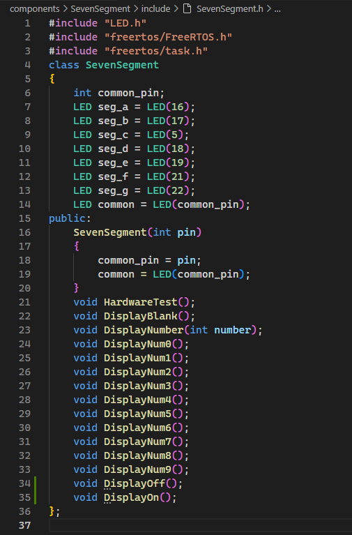

# ใบงานที่ 8-2 แก้ไข component Sevensegment
จากการทดลอง พบว่าเราไม่สามารถกำหนดให้ seven segment แสดงตัวเลขที่ต่างกันได้ เนื่องจาก seven segment ทั้งคู้ใช้สายสัญญาณ segment ร่วมกัน เราต้องแก้ code ของคลาส seven segment ให้แต่ละหลักทำงานได้โดยอิสระ

อย่างไรก็ตาม เราไม่สามารถแก้ไข managed component ได้ เนื่องจากถ้าทุกคนสามารถแก้ไข component ดังกล่าวได้ จะส่งผลกระทบต่อ repo ต้นทางเป็นอย่างมาก ดังนั้น เราควรที่จะ fork มาแล้วแก้ไข และทำ pull request แต่ในโปรเจคนี้ เราเป็นคนสร้าง component  เอง  จึงสามารถกลับไปแก้ที่โปรเจค sevenseg_component แล้ว push ขึ้นไปบน github อีกครั้ง 

# 2 กลับไปแก้ไข component seven segment ในโปรเจค sevenseg_component

2.1 เพิ่มฟังก์ชัน DisplayOff() และ DisplayOn() ในคลาส   SevenSegment

2.1.1 แก้ไขไฟล์ `SevenSegment.h` โดยเพิ่ม code  ตามตัวอย่าง (บรรทัดที่ 34 - 35)

2.1.2 แก้ไขไฟล์ `SevenSegment.cpp` โดยแก้ code ในฟังก์ชัน  `DisplayNum0()` ถึง `DisplayNum9()` โดยการลบบรรทัด `common.OFF();` และ `common.ON();` ออกไป ตามตัวอย่าง (ลบในทุกฟังก์ชัน)

2.1.3 เพิ่มฟังก์ชัน `DisplayOff()` และ `DisplayOn()` ในไฟล์ `SevenSegment.cpp` ไว้ด้านล่างฟังก์ชัน `DisplayNumber(int number)` โดยมีคำสั่งภายในฟังก์ชันดังรูป 

2.1.4 แก้ไขไฟล์ main.cpp ในโปรเจค sevenseg_component ดังรูป

2.1.5 ลบไฟล์ dependencies.lock เพื่อล้าง cache ในการ build มิฉะนั้น ESP-IDF จะใช้ source code เดิมที่ cache ไว้

2.1.6 ทดสอบ build และรันโปรแกรม จะต้องปรากฏเลข 15 บน seven segment

2.1.7 ถ้าปรากฏผลดังกล่าวแสดงว่า component นี้พร้อมใช้งานแล้ว ให้ push ขึ้นบน  github 