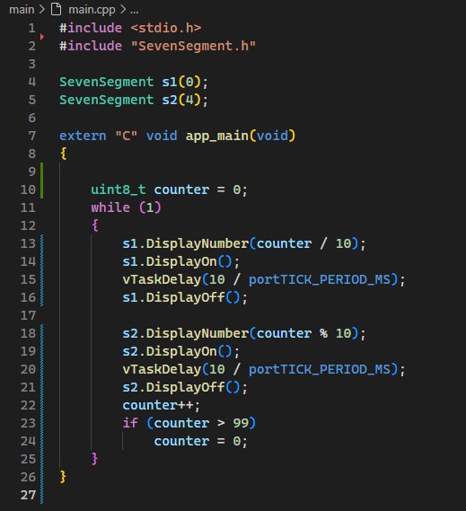

# ใบงานที่ 8-3  ใช้ component Sevensegment แสดงผลพร้อมกัน 2 หลัก

# 3 กลับไปแก้ไข project  `SevenSegment2Digits`

3.1 ในไฟล์ main.cpp ให้เพิ่มตัวแปร `uint8_t counter = 0` 

3.2 ใน loop while ให้แสดงเลขหลักหน่วยบน seven segment ตัวที่สอง และหลักสิบ บน seven segment ตัวที่ 1

การดึงหลักหน่วยออกจากตัวนับ ทำได้โดยการ mod ด้วย 10 `(counter % 10)`

การดึงหลักสิบออกจากตัวนับ ทำได้โดยการหารด้วย 10 `(counter / 10)`
 

3.3 ทดสอบ build และรันโปรแกรม

3.4 ถ้าปรากฏผลดังกล่าวแสดงว่า component นี้พร้อมใช้งานแล้ว ให้ push ขึ้นบน  github 
3.5 บันทึกวิดิโอของ LED seven segment และแนบ link วิดีโอในไฟล์นี้
[https://drive.google.com/file/d/1Ix9V4qVlsJiqif8fnqyDeL__VZ-WemIm/view?usp=sharing](https://drive.google.com/file/d/1lsYEic8l3QF07Yu8WVUNoOdjSDCULe-P/view?usp=sharing)

